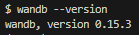
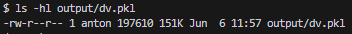
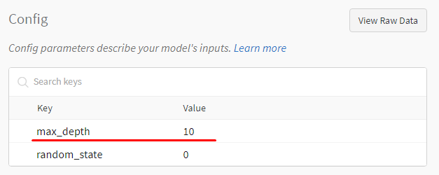
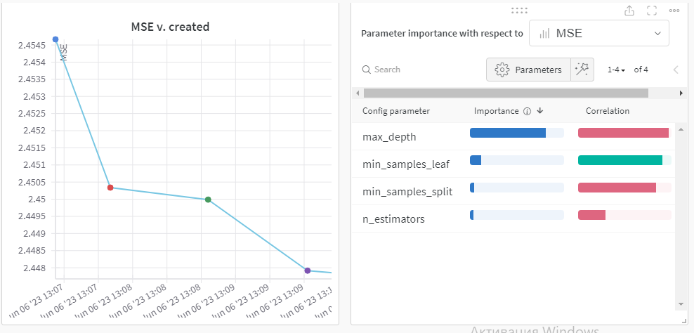
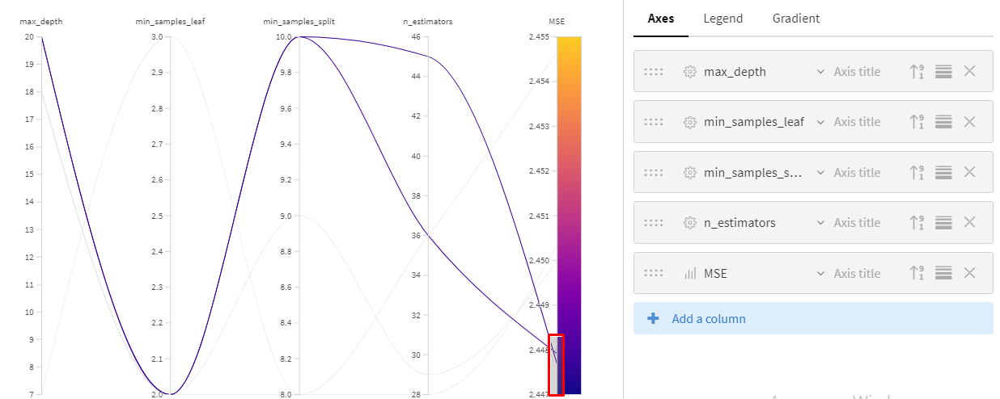
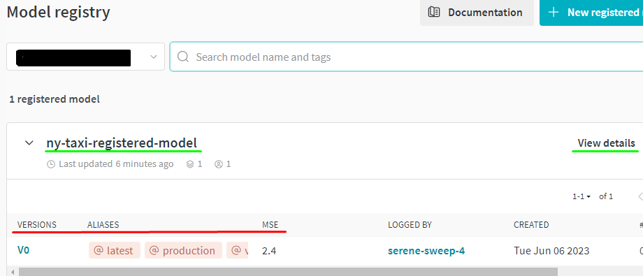
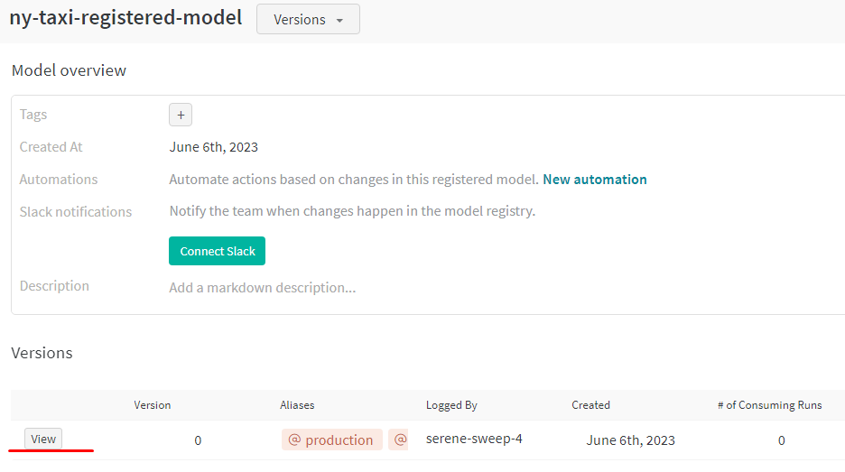
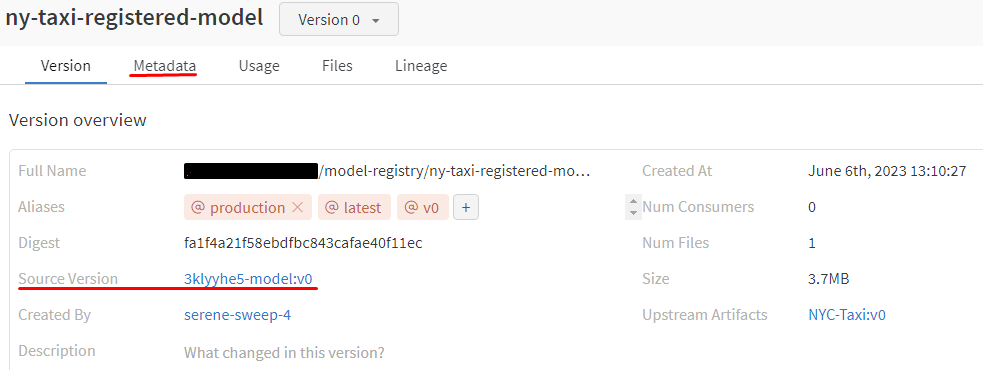

### Q1. Install the package

1. Activate the local python environment and Install Weights and Biases.
```bash
pip install wandb
```
2. Check the version.



### Q2. Download and preprocess the data
1. Create a folder in the project directory to store the data.
```bash
mkdir data
```
2. Create a .txt file with links to the data for download.
```download.txt
https://d37ci6vzurychx.cloudfront.net/trip-data/green_tripdata_2022-01.parquet
https://d37ci6vzurychx.cloudfront.net/trip-data/green_tripdata_2022-02.parquet
https://d37ci6vzurychx.cloudfront.net/trip-data/green_tripdata_2022-03.parquet
```
3. Download the data to the data folder.
```bash
wget -i download.txt -P ./data
```
4. Run the following script to preprocess the downloaded data.
```bash
python ./scripts/preprocess_data.py \
  --wandb_project ny-taxi-wandb \
  --wandb_entity <WANDB_USERNAME> \
  --raw_data_path ./data \
  --dest_path ./output
```
5. The size of the dv.pkl is 151K.
```bash
ls - hl output/dv.pkl
```



### Q3. Train a model with Weights & Biases logging

1. Modify the train script to log MSE and regressor.pkl by adding the following lines inside the run_train function:
```python
# TODO: Log `mse` to Weights & Biases under the key `"MSE"`
wandb.log({"MSE": mse})

# TODO: Log `regressor.pkl` as an artifact of type `model`
artifact = wandb.Artifact("xgboost-regressor-model", type="model")
artifact.add_file("regressor.pkl")
wandb.log_artifact(artifact)
```
2. Run the script to train the model.
```bash
python ./scripts/train.py \
  --wandb_project ny-taxi-wandb \
  --wandb_entity <WANDB_USERNAME> \
  --data_artifact "<WANDB_USERNAME>/ny-taxi-wandb/NYC-Taxi:v0"
```
3. The max_depth parameter is 10.


### Q4. Tune model hyperparameters
1. Pass the parameters `n_estimators`, `min_samples_split` and `min_samples_leaf` from `config` to RandomForestRegressor inside the run_train().
```python
rf = RandomForestRegressor(max_depth=config.max_depth,
                           n_estimators=config.n_estimators,
                           min_samples_split = config.min_samples_split,
                           min_samples_leaf = config.min_samples_leaf,
                           random_state=0)
```
2. Run the script to tune the model.
```python
python ./scripts/sweep.py \
  --wandb_project ny-taxi-wandb \
  --wandb_entity <WANDB_USERNAME> \
  --data_artifact "<WANDB_USERNAME>/<WANDB_PROJECT_NAME>/NYC-Taxi:v0"
```
3.  As shown in the images below, the most important parameter is max_depth:

Parameter Importance Pane


Parallel Cooridanates Plot


### Q5. Link the best model to the model registry

On the front page of the Registered Model UI we can see `Versioning`, `Aliases` and `Metric`.


If we move to View details > View, we can see `Source version` and `Metadata`.


